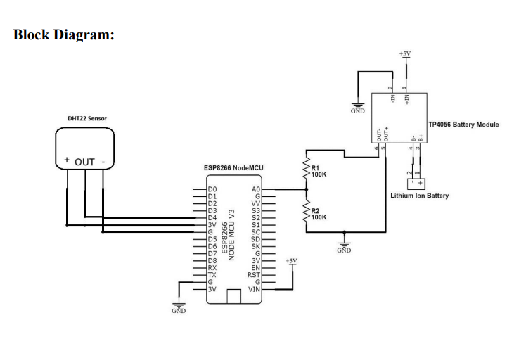
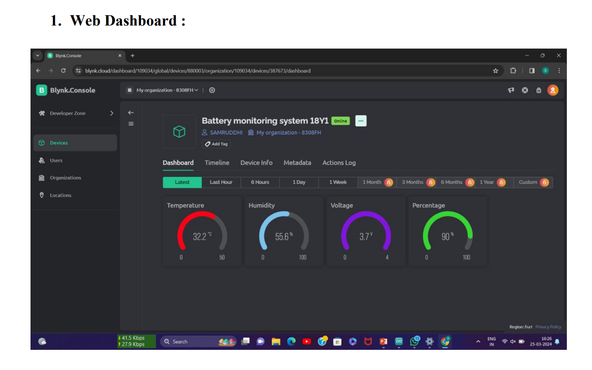

# 🔋 Battery Pulse System using IoT (ESP8266)

An **IoT-based Battery Pulse/Monitoring System** developed using **ESP8266 NodeMCU**, designed to monitor battery health parameters such as **voltage, temperature, humidity, and charge percentage** in real time.  
The system provides **remote monitoring, alerts, and protection** using the **Blynk Cloud Platform**.

---

## 📌 Project Overview

This project focuses on monitoring the health and performance of batteries used in **energy storage systems and solar power stations**.  
Sensor data is collected using IoT hardware, transmitted to the cloud, and visualized through **web and mobile dashboards** for real-time analysis and safety management.

---

## 🎯 Objectives

- Monitor battery voltage and state of charge (SoC)
- Measure temperature and humidity for safety
- Prevent battery overheating during charging
- Enable remote access via mobile and web dashboards
- Improve battery lifespan and operational efficiency

---

## 🧩 System Block Diagram

---

## 🛠 Hardware Components

- **NodeMCU ESP8266** – Wi-Fi enabled microcontroller
- **Li-ion Battery**
- **DHT22 Sensor** – Temperature & humidity monitoring
- **Temperature Protection (TP) Module**
- **Voltage Divider Circuit**
- **Charging Control Circuit**

---

## 💻 Software & Tools

- **Arduino IDE**
- **Blynk IoT Platform (Cloud & Mobile App)**
- **ESP8266 Board Package**
- **DHT Sensor Library**

---

## 🚀 Key Features

- 📊 Real-time battery voltage monitoring  
- 🔋 Battery percentage calculation  
- 🌡 Temperature & humidity monitoring  
- ⚠️ Over-temperature protection  
- 📱 Remote monitoring via Blynk app  
- 🔔 Alerts for low battery and overheating  

---

## 📊 System Dashboard

### 🌐 Web Dashboard (Blynk Cloud)
Real-time visualization of battery parameters through a web-based dashboard.

---

## ☁️ Blynk Virtual Pin Mapping

| Virtual Pin | Parameter |
|------------|----------|
| V1 | Temperature (°C) |
| V2 | Humidity (%) |
| V3 | Battery Voltage (V) |
| V4 | Battery Percentage (%) |
| V5 | Charging Status |

---

## 🔄 System Workflow

1. Sensors collect battery and environmental data  
2. ESP8266 processes the data  
3. Data is sent to Blynk Cloud via Wi-Fi  
4. Users monitor data on web/mobile dashboards  
5. Alerts are generated for critical conditions  

---

## 📈 Advantages

- Increased battery lifespan  
- Early detection of battery faults  
- Reduced manual inspection  
- Improved safety and reliability  
- Suitable for IoT-based energy systems  

---

## 🎓 Applications

- Academic / College Mini Project  
- Battery Management Systems (BMS)  
- Solar power station monitoring  
- IoT-based energy management  

---

## 🧪 How to Run the Project

1. Open `Battery_Pulse_System.ino` in **Arduino IDE**
2. Install required libraries (Blynk, DHT)
3. Select **ESP8266 NodeMCU** board
4. Configure Wi-Fi and Blynk credentials
5. Upload the code to ESP8266
6. Monitor data on Blynk dashboard

---

## 👤 Author

**Pranav Ithape**  
Department of CSE (AIML)  
SSPM’s College of Engineering, Kankavli  

---

## 👨‍🏫 Project Guide

**Prof. P. A. Ghadigaonkar**

---

## 📚 References

1. IEEE i-PACT 2021 – Battery Pulse System for Li-ion Batteries Using IoT  
2. Arduino Official Documentation  
3. Blynk IoT Platform  
4. ProjectHub Arduino  

---

## 📄 License

This project is developed for **academic and learning purposes**.
